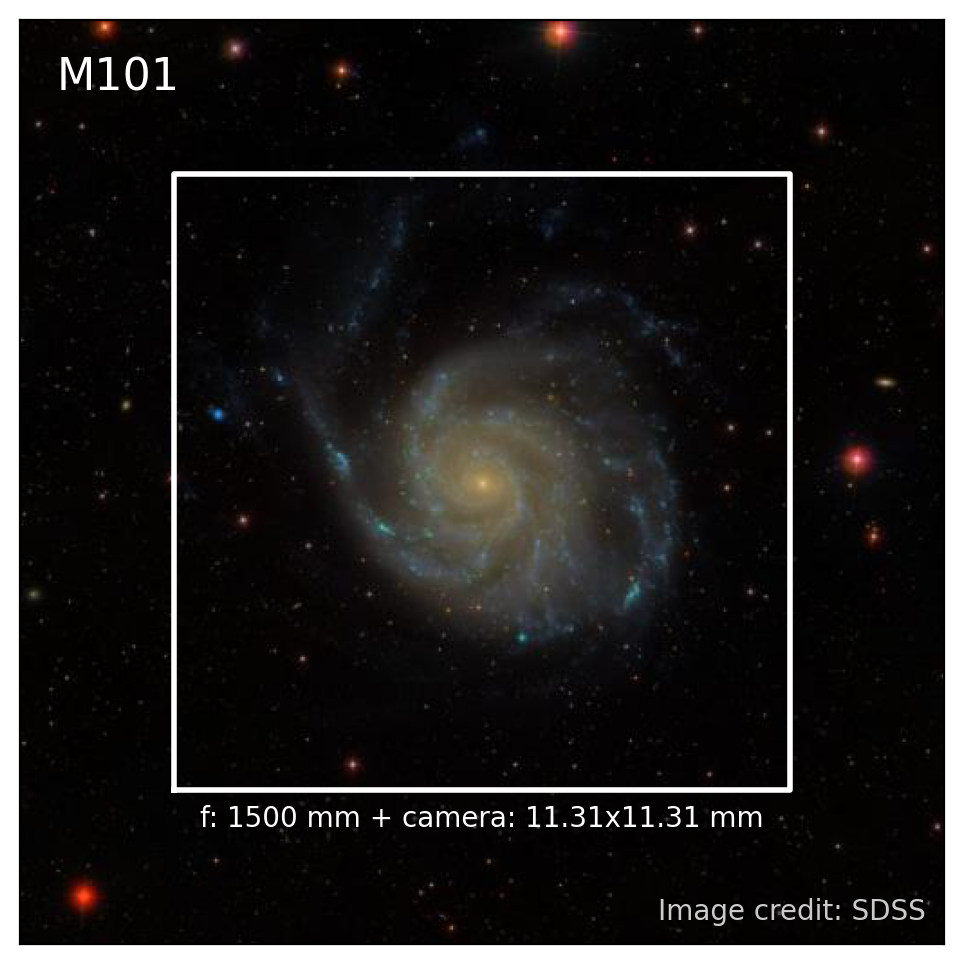

# Astrophotography FOV Simulator

A simulator of camera field of view (FOV) for astrophotography.

You only need to provide the **telescope focal length** and **camera sensor dimensions**.
The simulator will generate a mock photo of the astronomical object you are interested in.

The simulator is powered by and deployed via [`streamlit`](https://fovsim.streamlit.app/)!

## Contribute

Feel free to dive in! [Raise an issue](https://github.com/ybillchen/fov_simulator/issues/new) or submit pull requests. 
We recommend you to contribute code following [GitHub flow](https://docs.github.com/en/get-started/quickstart/github-flow). 

## Maintainers

- [@ybillchen (Bill Chen)](https://github.com/ybillchen)

